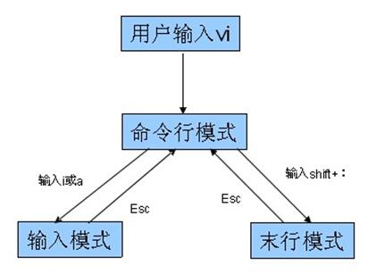
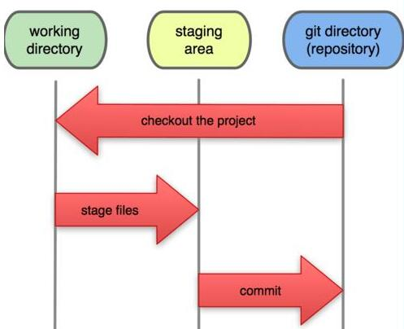

# git-day01
## 命令行概述
- dos（window）
- shell（Linux--csh ksh bash）

## 常用命令
- pwd (Print Working Directory) 查看当前目录
- cd (Change Directory) 切换目录，如 cd /etc
- ls (List) 查看当前目录下内容，如 ls -al
- mkdir (Make Directory) 创建目录，如 mkdir blog
- touch 创建文件，如 touch index.html
- cat 查看文件全部内容，如 cat index.html
- less 查看文件，如more /etc/passwd、less /etc/passwd
- rm (remove) 删除文件，如 rm index.html、rm -rf  blog
- rmdir (Remove Directory) 删除文件夹，只能删除空文件夹，不常用
- mv (move) 移动文件或重命名，如 mv index.html ./demo/index.html
- cp (copy) 复制文件，cp index.html ./demo/index.html
- tab 自动补全，连按两次会将所有匹配内容显示出来
- \> 和 >>重定向，如echo hello world! > README.md，>覆盖 >>追加
- | 管道符可以将多个命令连接使用，上一次（命令）的执行结果当成下一次（命令）的参数。
- grep 匹配内容，一般结合管道符使用

## vi编辑器
> linux操作系统标配，相当于windows下的记事本。

### vi编辑器的三种模式
> vi编辑器提供了3种模式，分别是命令模式、插入模式、底行模式，每种模式下用户所能进行的操作是不一样的。

- 3种模式的切换如下图所示：

### vi常用操作
- a) 打开/创建文件， vi 文件路径
- b) 底行模式 :w保存，:w filenme另存为
- c) 底行模式 :q退出
- d) 底行模式 :wq保存并退出
- e) 底行模式 :e! 撤销更改，返回到上一次保存的状态
- f) 底行模式 :q! 不保存强制退出
- g) 底行模式 :set nu 设置行号
- h) 命令模式 ZZ（大写）保存并退出
- i) 命令模式 u辙销操作，可多次使用
- j) 命令模式 dd删除当前行
- k) 命令模式 yy复制当前行
- l) 命令模式 p 粘贴内容
- m) 命令模式 ctrl+f向前翻页
- n) 命令模式 ctrl+b向后翻页
- o) 命令模式 i进入编辑模式，当前光标处插入
- p) 命令模式 a进入编辑模式，当前光标后插入
- q) 命令模式 A进入编辑模式，光标移动到行尾
- r) 命令模式 o进入编辑模式，当前行下面插入新行
- s) 命令模式 O进入编辑模式，当前行上面插入新行

## 版本控制概述
- 本地版本控制
- 集中版本控制
- 分布式版本控制

## git环境安装
- window安装
    + [下载地址](http://git-scm.com/download/win)，下载后和普通软件安装方式一样
- linux安装
    + CentOS发行版：sudo yum install git
    + Ubuntu发行版：sudo apt-get install git
- Mac安装
    + 打开Terminal直接输入git命令，会自动提示，按提示引导安装即可

## git工作原理
### git的三个工作区域
- 工作目录
- 暂存区域
- 本地仓库

### git管理文件的4中状态
- 未追踪untraced
- 已暂存staged
- 已提交commited
- 已修改modified

## git工作流程-本地创建仓库
1. 配置用户信息
2. 初始化仓库
3. 添加文件到暂存区
4. 提交文件
5. 查看文件状态
6. 查看提交历史
7. 撤销文件修改
8. 恢复版本

## git分支操作
### 分支概述

### 分支操作
1. 创建分支
2. 切换分支
3. 合并分支
4. 删除分支

## Git命令
- 配置用户信息
    + 全局配置，软件安装目录C:\Program Files\Git\mingw64\etc\gitconfig
    + 用户配置，用户名目录C:\Users\www\.gitconfig
    + 项目配置，项目目录
    + git config --global user.name zhangsan
    + git config --global user.email "zhangsan@163.com"
- 查看文件状态
    + git status
- 查看提交记录(按q键退出)
    + git log
- 工作区添加到暂存区
    + git add
- 暂存区覆盖工作区内容
    + git checkout
- 暂存区提交到本地仓库
    + git commit -m 'bug fixed'
- 回滚特定版本
    + git reset --hard <commit>

